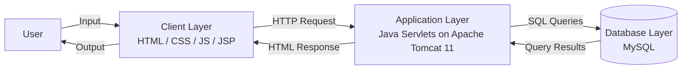

# LockedIn

**_An ATS built for the job seeker's side of the process rather than the recruiter's._**

LockedIn is a career-search platform designed to simplify the job hunt with a built-in application-tracking dashboard and a skill/location-based job recommender.

**Current State:** This repository implements the home page with a runnable virtual 3-tier architecture (client → Tomcat/servlet → MySQL) demonstrated through a live count of open job postings on the page.

## Tech Stack

- **Client:** HTML, CSS, JS, JSP
- **Application:** Java Servlets + JSP on Apache Tomcat 11
- **Database:** MySQL
- **Build tool:** Maven

## Architecture



## Project Structure

```
CS157A-team5/
├─ src/
│  └─ main/
│     ├─ java/
│     │  └─ com/
│     │     └─ lockedin/
│     │        ├─ dao/
│     │        │  └─ JobDAO.java        # Job-related queries
│     │        ├─ servlets/
│     │        │  └─ HomeServlet.java   # Handles requests to home page
│     │        ├─ test/
│     │        │  └─ DBTesting.java     # Tests DB connection
│     │        └─ util/
│     │           └─ DBConnection.java  # Opens DB connection
│     ├─ resources/
│     │  └─ db.properties.example       # Format for DB credentials (gitignored)
│     └─ webapp/
│        ├─ css/
│        │  └─ home.css
│        ├─ js/
│        │  └─ home.js
│        ├─ WEB-INF/
│        │  ├─ views/
│        │  │  └─ home.jsp              # Home page
│        │  └─ web.xml
│        └─ index.jsp                   # Entry point redirecting to /home
├─ sql/
│  └─ sample.sql                        # Schema with sample data
├─ .gitignore
├─ pom.xml
└─ README.md
```

## Environment Requirements

- **Java 17**
- **Apache Tomcat 11**
- **MySQL Server**
- **Maven**

## Setup and Run

### 1. Clone the repo

```bash
git clone https://github.com/your-org/CS157A-team5.git
cd CS157A-team5
```

<br>

### 2. Set up the database

```bash
mysql -u your_username -p < sql/sample.sql
```

> Creates the `lockedin_db` database and `job_postings` table with sample data

<br>

### 3. Configure database credentials

```bash
cp src/main/resources/db.properties.example src/main/resources/db.properties
```

> Copies `db.properties.example` into `db.properties`

<br>

Add your local MySQL credentials to `db.properties`.

```properties
db.url=jdbc:mysql://localhost:3306/lockedin_db
db.user=your_mysql_username
db.password=your_mysql_password
```

<br>

### 4. Build the project

```bash
mvn clean package
```

> Builds the app and produces `target/LockedIn.war`

<br>

### 5. Deploy to Tomcat

**Using VS Code:** Deploy via the **Community Server Connectors** VS Code extension (Tomcat server pointed at your local Tomcat 11 install).

**Using Tomcat:** Copy `target/LockedIn.war` into Tomcat's `webapps/` folder and start Tomcat.

<br>

### 6. View the app

```
http://localhost:8080/LockedIn/
```

> Loads `index.jsp` → redirects to `/home` → `HomeServlet` → forwards to `home.jsp`

<br>

## Dependencies

| Dependency            | Version | Purpose                                     |
| --------------------- | ------- | ------------------------------------------- |
| `jakarta.servlet-api` | 6.0.0   | Servlet API (provided by Tomcat at runtime) |
| `mysql-connector-j`   | 8.3.0   | JDBC driver for MySQL                       |

Managed via Maven. Installed automatically by `mvn clean package`. No manual downloads needed.

---

> _Developed as a semester project for SJSU's CS 157A (Database Management Systems) course during the Fall 2026 term_
